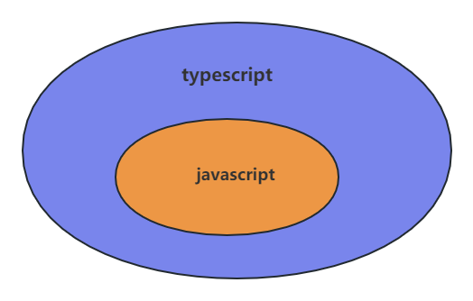

## Typescript大纲介绍

### 简介

#### 定义

`typescript`是`javascript`类型的超集，也就是说，所有`javascript`程序已经是`typescript`程序,它可以编译成纯`javascript`.
`typescript`添加了类型系统，对`javascript`运行时进行建模，并尝试发现在运行时引发异常的代码.
`typescript`在编码时使用，编译运行后生成浏览器识别的`javascript`代码，并移除了所有的类型检查,`typescript`类型不影响代码运行时的行为或性能.



#### 安装

```bash
npm install typescript -g
```

#### 编译

```typescript
// helloTypescript.ts
function sayHello(person: string) {
    return 'Hello, ' + person;
}

let user = 'Tom';
console.log(sayHello(user));
```
编译ts代码：
```bash
tsc helloTypescript.ts
```
运行之后会在同级目录生成对应的同名`js`文件,内容如下：
```javascript
function sayHello(person) {
    return 'Hello, ' + person;
}
var user = 'Tom';
console.log(sayHello(user))
```
发现类型声明已经被删除，因为`TypeScript`只会在编译时对类型进行静态检查，如果发现有错误，编译的时候就会报错。而在运行时，与普通的 `JavaScript` 文件一样，不会对类型进行检查
### 基础

#### 基本类型
1. boolean

```typescript
let isDone: boolean = false;

```

2. string
```typescript
let myName: string = 'Tom';
let myAge: number = 25;

// 模板字符串
let sentence: string = `Hello, my name is ${myName}.
I'll be ${myAge + 1} years old next month.`;

```
编译结果：
```javascript
var myName = 'Tom';
var myAge = 25;
// 模板字符串
var sentence = "Hello, my name is " + myName + ".
I'll be " + (myAge + 1) + " years old next month.";
```


3. number

```typescript
let decLiteral: number = 6;
let hexLiteral: number = 0xf00d;
// ES6 中的二进制表示法
let binaryLiteral: number = 0b1010;
// ES6 中的八进制表示法
let octalLiteral: number = 0o744;
let notANumber: number = NaN;
let infinityNumber: number = Infinity;
```
编译结果：
```javascript
var decLiteral = 6;
var hexLiteral = 0xf00d;
// ES6 中的二进制表示法
var binaryLiteral = 10;
// ES6 中的八进制表示法
var octalLiteral = 484;
var notANumber = NaN;
var infinityNumber = Infinity;
```

4. null
TypeScript里，`undefined`和`null`两者各自有自己的类型分别叫做`undefined`和`null`。 和 void相似，它们的本身的类型用处不是很大
默认情况下null和undefined是所有类型的子类型。 就是说你可以把 null和undefined赋值给number类型的变量

```typescript

let n: null = null;
```

5. undefined

```typescript
let u: undefined = undefined;
```

6. symbol

#### 类型断言(type assetion)
手动指定一个值的类型
```text
// 语法
值 as 类型
或者
<>值

```
- 将一个联合类型判断断言为其中一个类型
- 将一个父类断言为更加具体的子类
- 将任何一个类型断言为`any`
- 将any断言为一个具体的类型

#### 声明

- 声明语句,`declare <Type>`
- 声明文件:声明语句所在的文件，以`.d.ts`结尾


### 进阶

1. 类型


2. 接口
在 TypeScript 中，我们使用接口（Interfaces）来定义对象的类型
用于对类的一部分行为进行抽象，也常用于对「对象的形状（Shape）」进行描述

赋值的时候，变量的形状必须和接口的形状保持一致。


3. 泛型
泛型（Generics）是指在定义函数、接口或类的时候，不预先指定具体的类型，而在使用的时候再指定类型的一种特性
